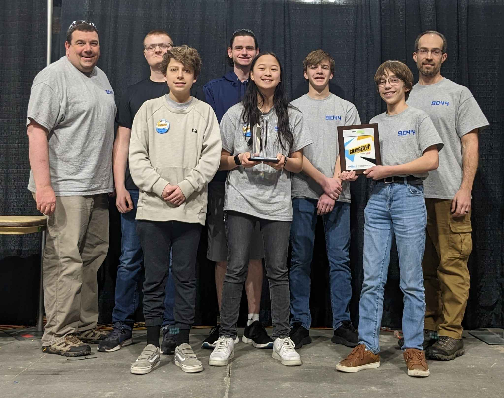
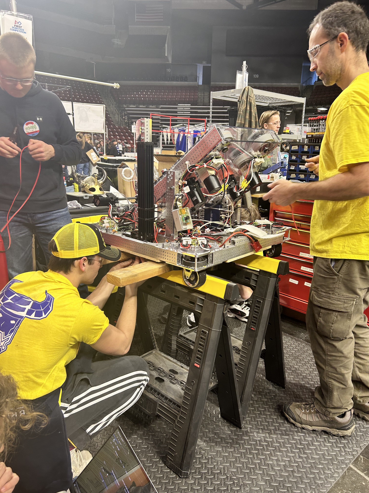

## Welcome to Team 9044: The TeraViks!

### Inspiring Innovation Through Robotics

#### Who We Are
The TeraViks, Team 9044, are a passionate group of high school students dedicated to exploring the exciting world of robotics through the _FIRST_® Robotics Competition. Our team combines diverse talents and backgrounds, working together to design, build, and program cutting-edge robots that showcase our creativity and technical skills.

#### Our Mission
At the TeraViks, we believe in the power of collaboration, innovation, and community. Our mission is to inspire a love for science, technology, engineering, and mathematics (STEM) in ourselves and in the younger generations. Through mentorship and outreach, we strive to make robotics accessible and exciting for everyone.

#### Why Join Us?
- **Hands-On Experience:** Dive into the world of robotics with opportunities to design, build, and program robots.
- **Teamwork & Leadership:** Develop essential skills while collaborating with fellow team members and mentors.
- **Community Impact:** Engage in outreach initiatives to inspire the next generation of STEM enthusiasts.
- **Fun & Friendship:** Build lasting relationships through teamwork, competitions, and memorable events.

#### Get Involved
Whether you’re a student looking to join our team or a community member interested in supporting our initiatives, we invite you to connect with us! Explore our website to learn more about our projects, events, and how you can contribute to our mission.

#### Stay Connected
Follow us on our social media channels to keep up with our latest updates, competition results, and outreach events. Join the TeraViks community and be part of our journey as we continue to innovate and inspire! @teraviks9044 on Instagram and Team TeraViks on YouTube, or email us if you are intrested at teraviks.robotics@gmail.com!
